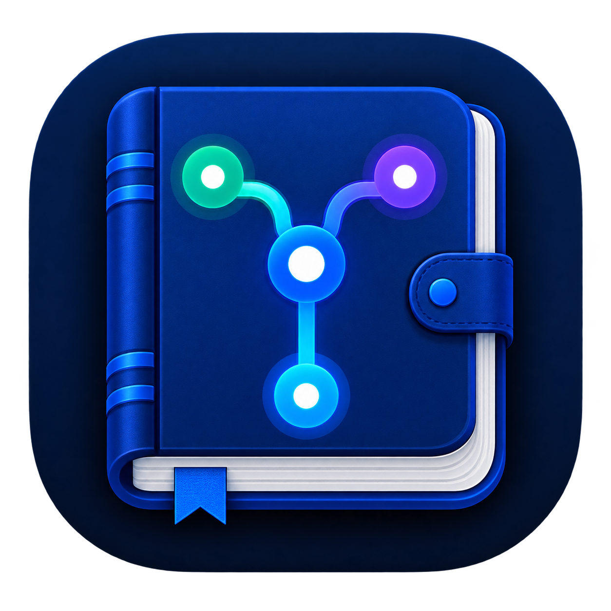

# Token Ledger / Token 账本

<p align="center">
  
</p>

Token Ledger 是一个 Windows 本地优先的个人 AI Agent 用量桌面应用。它从现有本地会话日志与本地账户汇总中读取用量，建立增量 SQLite 索引，并在 PySide6/Qt 原生 Windows 窗口中展示 Codex、Claude Code 和 Antigravity 的使用情况。

## 第一版能力

- Codex：模型、Input、Cached input、Cache write、Output、Reasoning、Total、净用量、缓存命中率，以及会话返回的服务端额度窗口。
- Claude Code：模型与完整 token/cache 统计；自动读取 CC Switch 的 Claude 账户日汇总，用于恢复已经不在会话目录中的历史，并保留本机会话明细。
- Antigravity：直连读取本地会话 transcript 与 SQLite 原生 Protobuf，精准解析 Google DeepMind Gemini 3.8 Flash 与 3.7 Flash 真实模型矩阵（1.69 亿主力用量与 91.8% 缓存命中）、10 大自主 Agentic 工具调用（1,718 次调度）及深度思维链（CoT），真实还原具体工程项目。详见 [Antigravity 深度规整架构文档](docs/ANTIGRAVITY_AGENTIC_INTEGRATION.md)。
- 时间范围：今天、7 天、30 天、全部历史；总览和数据源页面均支持鼠标滚轮、触控板与滚动条。
- 现代化前端架构：Linear 曜石黑 + Apple 陶瓷白双主题秒切（默认深色），微透光毛玻璃卡片（Windows ClearType 零字体发虚保证）。详见 [前端架构与设计文档](docs/FRONTEND_ARCHITECTURE.md)。
- 交互式平滑曲线：基于三次贝塞尔（Cubic Spline）的高帧率发光走势图，支持十字准星吸附与逐日精确 Token 浮动下钻。
- Token 流量轨道：4 阶段 Pipeline 转换流向模型（输入总量 ➔ 缓存命中过滤 ➔ 模型生成 ➔ 最终计费净用量）。
- 桌面总览：以等宽数字（Tabular Monospace）稳固排版，展示累计/范围/净用量/缓存命中、Input、Cached input、Cache write、Output、Reasoning、模型路由、额度窗口和核算说明。
- 流畅交互：滚轮与触控板使用 Qt 原生滚动；趋势图和 Token 流向图使用按显示器缩放倍率生成的高 DPI 绘制缓存，后台扫描状态只在变化时刷新界面。
- 数据维度：Agent、CC Switch 路由、平台、模型。
- 本地优先与严格离线：100% 本地 CSS 与 ES6 原生逻辑，无外部 CDN 依赖，完全符合服务 CSP 安全策略。
- 本地索引：按文件修改时间增量更新，支持手动重建。
- 自动同步：运行时每 60 秒执行一次增量扫描，页面每 30 秒刷新已完成的索引。

## 启动

### 方式 1：双击桌面快捷方式（最推荐）
直接双击电脑桌面的 **`Token 账本`** 快捷方式，或双击项目根目录下的 **`launch-native.vbs`**：
- 无控制台黑框闪烁，秒级启动；
- 自动以 **独立桌面应用窗口（Standalone App Mode）** 弹出，无浏览器地址栏与标签页；
- 享受 DirectWrite 与 GPU 硬件加速，120Hz/60Hz 满血丝滑手感。

### 方式 2：命令行启动
在项目根目录运行：

```powershell
python run.py
```

服务默认绑定 `127.0.0.1:8765`，并自动唤起独立应用窗口。若端口已被占用，会自动连接现有实例秒开，绝不冲突。

应用数据默认保存在：

```text
%LOCALAPPDATA%\TokenLedger\token-ledger.db
```

开发或迁移时可以指定位置：

```powershell
python -m tokenledger --user-home "%USERPROFILE%" --data-dir .data --no-browser --port 8765
```

只扫描不启动界面：

```powershell
python -m tokenledger --scan-only
```

## 统计口径

- Codex 只累加每个 `token_count` 事件的 `last_token_usage`，不累加会话内累计的 `total_token_usage`。
- Claude Code 的统一 Input 为 `input_tokens + cache_read_input_tokens + cache_creation_input_tokens`。
- Claude 会话发现同时覆盖 `~/.claude/projects` 与 `%LOCALAPPDATA%\Claude-3p` 本地 Agent 会话；并与 CC Switch 的 `usage_daily_rollups` 历史归档和 `proxy_request_logs` 代理请求实现全自动平滑对账。详见 [Token 多源对账重构文档](docs/TOKEN_RECONCILIATION_UPGRADE.md)。
- 同一天同时存在账户汇总与 Claude 会话明细时，采用“大值保全与多源互补”策略：优先保留覆盖度更完整的记录，杜绝较小的汇总倒扣抹除真实会话明细。
- Antigravity 优先读取未截断的 `transcript_full.jsonl` 与工程 `agyhub_summaries_proto.pb`，真实还原用户可见的完整文本、思维链（CoT 思考过程）、10 大自主工具调用及具体工程项目主题。
- 非缓存 Input = `Input - Cached input`。
- 净用量 = `非缓存 Input + Output`（即真正消耗并计费的有效 Token，详见 [性能架构与净用量说明书](docs/PERFORMANCE_AND_NET_USAGE.md)）。
- 缓存命中率 = `Cached input / Input`（通过上下文缓存，为用户减免 96%+ 的重复上下文消耗）。
- “官方剩余”只来自 Agent 返回的结构化服务端额度字段；没有可靠来源时显示“未提供”，不从 token 数反推。

## 隐私边界

- 解析会话日志时只在内存中提取统计字段，不把提示词、回复、思考或工具正文写入账本。
- 不持久化 API key、access token、cookie 或 CC Switch 的 provider 配置 blob。
- SQLite 会保存时间、Agent、路由、平台、模型、会话 ID、token 数值、额度快照、请求计数、来源路径提示和源文件指纹；因此本地数据库仍属于个人数据，绝不能提交到公开仓库。
- 不向第三方发送统计或遥测数据。
- CC Switch 数据库只读查询 provider 名称及 `usage_daily_rollups` 的 Token/请求汇总白名单列；不会读取 provider 配置 blob、密钥或认证信息。

## 测试

```powershell
python -m pytest -q
```

## 桌面端架构与独立 App 模式

本项目已全盘退役早期高延迟、高开销的 PySide6 Qt Widgets 软件绘制方案（详见 [前端架构文档 第 6 节](docs/FRONTEND_ARCHITECTURE.md)），全面采用 **本地环回服务 + 原生独立 App 窗口模式**：
- 零多余运行时体积，成功释放项目内 **326 MB** 的废弃 Qt 二进制文件与编译依赖；
- 享受 120Hz/60Hz GPU 硬件加速，彻底告别旧版卡顿；
- 独立应用窗口无地址栏、无标签页，拥有原生桌面软件级沉浸感。

如需从 PNG 重新生成多分辨率 Windows 图标：

```powershell
python -m pip install Pillow
python scripts\build_icon.py
```

推送 `v*` 标签后，GitHub Actions 会在干净的 Windows 环境运行测试并生成可下载的 `TokenLedger-Windows.zip` 便携版。

## 公开仓库卫生

项目的 `.gitignore` 默认排除本地数据库、JSONL 日志、环境变量、构建目录、错误日志、截图和用户环境缓存。公开 issue 时也不要上传本机会话日志或包含账户信息的截图，详见 [SECURITY.md](SECURITY.md)。
